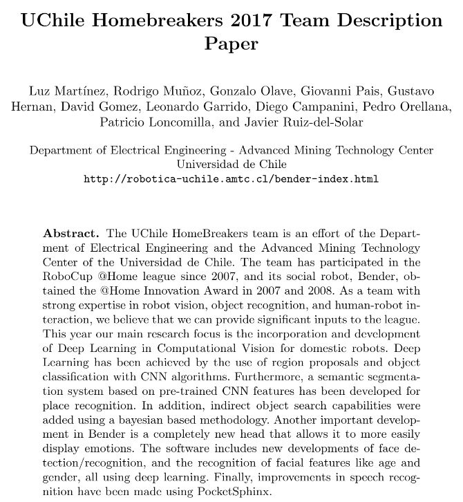

# Team Description

In this repository, you can find the paper that describes the work done by the team  UChile HomeBreakers 2017 to participate in the RoboCup Nagoya Japan 2017.

The team worked on developing Deep Learning algorithms for Humanoid Robots.

[]

